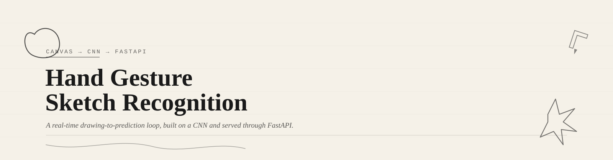
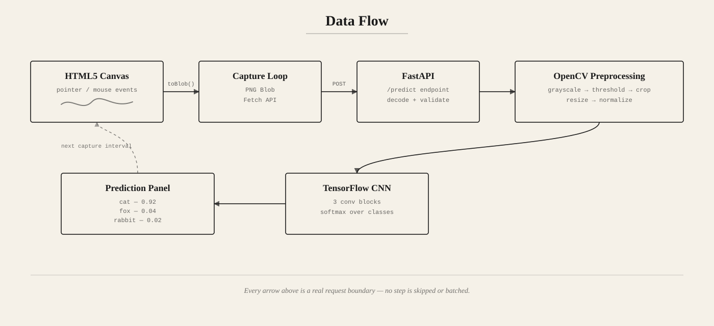
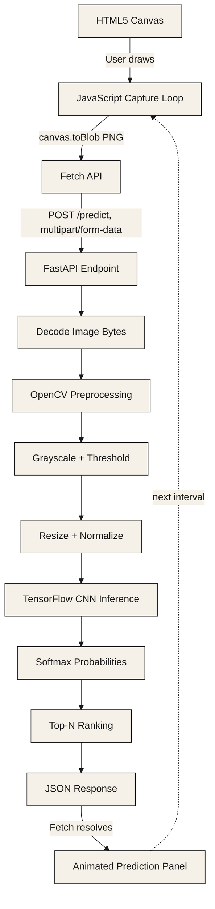

<p align="center">
  
</p>

<p align="center">
  
  
  
  
  

</p>

<p align="center"><i>Draw. Predict. Repeat — a real-time sketch recognition system built on a CNN and served over FastAPI.</i></p>

<p align="center">
  
</p>

---

## Table of Contents

- [Overview](#overview)
- [Features](#features)
- [Architecture](#architecture)
- [Preprocessing Pipeline](#preprocessing-pipeline)
- [Model Architecture](#model-architecture)
- [API Documentation](#api-documentation)
- [Installation](#installation)
- [Usage](#usage)
- [Tech Stack](#tech-stack)
- [Contributing](#contributing)
- [License](#license)
- [Credits](#credits)

---

## Overview

Hand Gesture Sketch Recognition is a full-stack web application:

- The **frontend** is a plain HTML5 canvas with JavaScript event handlers for freehand drawing.
- Every few hundred milliseconds, the canvas is serialized into a **PNG blob** and sent to the backend.
- The **backend** (FastAPI) receives the image, runs it through an **OpenCV preprocessing pipeline**, and feeds the result into a **TensorFlow CNN**.
- The model returns a probability distribution over sketch classes, and the top predictions (with confidence scores) are sent back and rendered live in an animated prediction panel.

No page reloads, no manual "submit" button required — the loop runs continuously while the user draws, with an explicit **pause mode** for when they want to stop sending frames without clearing the canvas.

---

## Features

<table>
<tr>
<td width="33%" valign="top" align="center">
<br><br>

**Canvas-Native Drawing**
No external drawing library — built directly on the HTML5 Canvas API and pointer/mouse events for minimal overhead.
</td>
<td width="33%" valign="top" align="center">
<br><br>

**Live Sketch Recognition**
Predictions update continuously as the user draws, not just on a final "submit."
</td>
<td width="33%" valign="top" align="center">
<br><br>

**Confidence-Ranked Predictions**
Every response returns a ranked list of the model's top guesses with associated confidence scores, not a single best-guess label.
</td>
</tr>
<tr>
<td width="33%" valign="top" align="center">
<br><br>

**Pause Prediction Mode**
Freezes inference without wiping the canvas — useful for review, screenshots, or simply pausing to think about the next stroke.
</td>
<td width="33%" valign="top" align="center">
<br><br>

**Responsive Interface**
Layout adapts across desktop and tablet viewports; canvas and prediction panel resize together.
</td>
<td width="33%" valign="top" align="center">
<br><br>

**Modular Frontend/Backend Split**
The frontend has no knowledge of model internals; the backend has no knowledge of canvas/DOM state — communication is a single JSON-over-HTTP contract.
</td>
</tr>
</table>

---

## Architecture

<p align="center">
  
</p>

<details>
<summary><b>Show interactive diagram</b></summary>
<br>



</details>

The loop is intentionally circular: the frontend never waits for user confirmation before sending the next frame — it waits for the *previous request to resolve*, which naturally throttles request frequency to whatever the backend and network can sustain, rather than flooding the server with a fixed-interval timer.

---

## Preprocessing Pipeline

A hand-drawn PNG straight off a browser canvas is not something a CNN trained on a clean, normalized sketch dataset can consume directly. The preprocessing stage exists to close that distribution gap — every step below is solving a specific mismatch between "what the canvas produces" and "what the model expects."

| Step | Operation | Why it's needed |
|---|---|---|
| 1. Decode | Convert incoming PNG bytes to a NumPy array via OpenCV | The canvas sends compressed image bytes, not raw pixel arrays — this is the bridge between HTTP payload and a matrix the model can operate on. |
| 2. Grayscale | Convert RGBA → single-channel grayscale | Canvas strokes carry no meaningful color information; keeping 3–4 channels would triple inference cost for zero accuracy gain. |
| 3. Thresholding | Binarize pixels (stroke vs. background) | Anti-aliased canvas strokes produce soft gray edges. Thresholding removes anti-aliasing noise so the model sees a clean, high-contrast stroke shape, matching the sharp binary sketches it was trained on. |
| 4. Bounding-box crop | Crop to the tightest box containing ink | Users draw at wildly different scales and positions on the canvas. Cropping to content removes irrelevant blank space so the model reasons about shape, not position. |
| 5. Resize | Scale cropped region to the model's fixed input size (28×28 or 64×64 depending on model version) | CNNs require a fixed input tensor shape; resizing after cropping (rather than before) preserves the aspect-ratio-normalized shape of the actual drawing. |
| 6. Normalize | Scale pixel values to `[0, 1]` (or standardize to training-set mean/std) | Keeps input magnitude consistent with what the network saw during training, so learned weights behave as expected instead of over- or under-saturating activations. |
| 7. Reshape | Add batch and channel dimensions | TensorFlow expects a `(batch, height, width, channels)` tensor even for a single inference call. |

```python
# backend/preprocessing.py (illustrative)
def preprocess(image_bytes: bytes) -> np.ndarray:
    img = decode_png(image_bytes)              # 1. decode
    gray = to_grayscale(img)                   # 2. grayscale
    binary = threshold(gray)                   # 3. binarize
    cropped = crop_to_content(binary)          # 4. bounding-box crop
    resized = resize(cropped, size=MODEL_INPUT_SIZE)  # 5. resize
    normalized = resized.astype("float32") / 255.0     # 6. normalize
    return normalized.reshape(1, *MODEL_INPUT_SIZE, 1) # 7. reshape
```

Skipping any one of these steps doesn't just degrade accuracy marginally — it tends to fail silently in specific, confusing ways (e.g. a model that "mysteriously" prefers thick strokes, or one that's sensitive to where on the canvas the user happened to draw).

---

## Model Architecture

The core classifier is a compact convolutional neural network, sized deliberately small so that CPU inference stays well under the latency budget needed for a "live" feel.

```text
Input (H x W x 1, grayscale)
   │
   ▼
Conv2D(32, 3x3, ReLU) → BatchNorm → MaxPool(2x2)
   │
   ▼
Conv2D(64, 3x3, ReLU) → BatchNorm → MaxPool(2x2)
   │
   ▼
Conv2D(128, 3x3, ReLU) → MaxPool(2x2)
   │
   ▼
Flatten → Dense(256, ReLU) → Dropout(0.4)
   │
   ▼
Dense(num_classes, Softmax)
```

**Design rationale:**
- **Three convolutional blocks** are enough to capture stroke curvature, junctions, and coarse shape — sketch classification doesn't need the depth that photographic classification does, since the input is already binarized and low-detail.
- **BatchNorm after early convolutions** stabilizes training given the relatively small, sometimes noisy dataset of freehand sketches.
- **Dropout before the final dense layer** compensates for the fact that hand-drawn sketches (unlike curated datasets) vary enormously in style between users, and the model needs to generalize rather than memorize specific drawing habits.
- **Softmax output** rather than a single argmax decision — this is what makes ranked, confidence-scored predictions possible in the first place (see [Engineering Decisions](#engineering-decisions)).

---

## API Documentation

### `POST /predict`

Accepts a single sketch image and returns ranked predictions with confidence scores.

**Request**

| Field | Type | Location | Required | Description |
|---|---|---|---|---|
| `file` | `image/png` | `multipart/form-data` | Yes | The canvas snapshot captured via `canvas.toBlob()`. |

**Response** — `200 OK`

```json
{
  "predictions": [
    { "label": "cat", "confidence": 0.92 },
    { "label": "fox", "confidence": 0.04 },
    { "label": "rabbit", "confidence": 0.02 }
  ],
  "inference_ms": 38.7
}
```

| Field | Type | Description |
|---|---|---|
| `predictions` | `array` | Top-N classes sorted by descending confidence. |
| `predictions[].label` | `string` | Human-readable class name. |
| `predictions[].confidence` | `float` | Softmax probability, `0.0`–`1.0`. |
| `inference_ms` | `float` | Server-side time spent on preprocessing + model forward pass, useful for client-side performance logging. |

---

## Installation

### Prerequisites

- Python 3.10+
- `pip` / `venv`
- A modern browser with Canvas and Fetch API support (any current Chrome, Firefox, Edge, Safari)

### Steps

```bash
# 1. Clone the repository
git clone https://github.com/<your-username>/hand-gesture-sketch-recognition.git
cd hand-gesture-sketch-recognition

# 2. Create and activate a virtual environment
python -m venv venv
source venv/bin/activate        # Windows: venv\Scripts\activate

# 3. Install backend dependencies
pip install -r backend/requirements.txt

# 4. Place/confirm the trained model file
#    backend/model/sketch_cnn.h5 and backend/model/labels.json must exist
```

---

## Usage

### Run the backend

```bash
cd backend
uvicorn main:app --reload --host 0.0.0.0 --port 8000
```

The API will be live at `http://localhost:8000`, with interactive docs at `http://localhost:8000/docs`.

### Serve the frontend

The frontend is static — serve it with any simple HTTP server (or open `index.html` directly if CORS is configured to allow `file://` origins):

```bash
cd frontend
python -m http.server 5500
```

Then open `http://localhost:5500` in your browser.

### Draw and predict

1. Draw on the canvas using your mouse or trackpad.
2. Predictions appear in the panel and update automatically as you draw.
3. Use the **Pause** button to freeze predictions without clearing the canvas.
4. Use the **Clear** button to reset the canvas and prediction panel.
---

## Tech Stack

| Layer | Technology |
|---|---|
| Backend framework | FastAPI |
| Model framework | TensorFlow / Keras |
| Image processing | OpenCV |
| Numerical computing | NumPy |
| Frontend | HTML5 Canvas, vanilla JavaScript, CSS |
| Networking | Fetch API |
| Serving | Uvicorn (ASGI) |

---

<p align="center"><i>Hand Gesture Sketch Recognition — draw it, and see what the model sees.</i></p>
